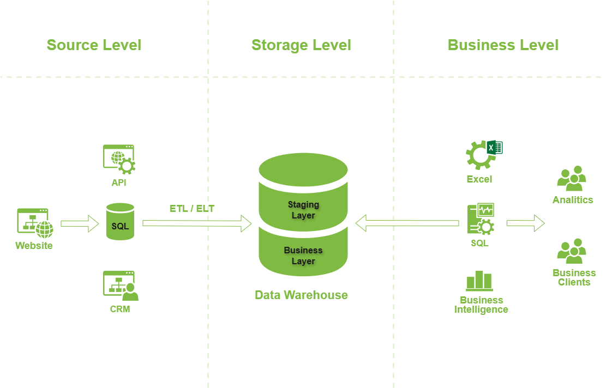

# 1. Аналитика в организации
#### [Назад в Содержание ⤶](/README.md)

## 1.1 Архитектура аналитического решения
Архитектура аналитического решения торговой сети **«Superstore»** имеет 3 уровня:

1. **Уровень источников данных (Source Level)**

_Данные собираются из различных источников (API сайта, промежуточной БД, системы CRM) с помощью ETL/ELT процессов._

2. **Уровень хранения данных (Storage Level)**

_Единая целевая база данных – Хранилище данных (Data Warehouse, DWH)._

DWH, в свою очередь, имеет два слоя:

- ***Staging Layer***

_Это временная область хранения данных перед их загрузкой в основное хранилище 
(буферизация данных между источниками и хранилищем)._

- ***Business Layer***

_Это основная часть хранилища, содержащая очищенные, интегрированные и готовые для анализа данные 
(предоставление единой версии данных для организации)._

3. **Уровень для доступа к данным (Business Level)**

_Данные как товар для целевой аудитории – бизнес клиентов, аналитиков._

Воспользуемся программой **[draw.io](https://github.com/jgraph/drawio-desktop/releases/tag/v26.2.2)** для отрисовки 
схемы нашей архитектуры.

## 1.2. Создание дашборда
Задача построить отчеты и дашборд в **Excel** на основе [полученных данных](/data/Superstore.xls).

### 1.2.1 Знакомство с данными
После ознакомления с первичными данными, последовало их объединение в одну рабочую таблицу `Orders`, 
на основе которой будет построена отчетность и дашборд.

### 1.2.2 Составление плана отчетности
Важно определить, что будет выведено и в каком виде, т.к. от этого зависит результат последующего анализа.

> _В процессе работы не забудьте обсудить содержание отчёта с заинтересованными лицами!_

#### План отчетности
Итак, отчет будет состоять из следующих параметров и показателей:

|***Параметры и показатели***|***Визуализация***|
|---|---|
|Основные показатели|Таблица|
|Динамика дохода и прибыли|Диаграмма-график|
|Категории товаров (сравнение)|Линейчатая диаграмма|
|Суб-Категории товаров (сравнение)|Гистограмма|
|Региональные менеджеры (сравнение)|Гистограмма|
|Сегменты (сравнение)|Гистограмма|
|Динамика по сегментам|Диаграмма-график|
|По штатам|Картограмма|
|По регионам (сравнение)|Круговая|
|По возвратам в %|Круговая|

### 1.2.3 Создание отчетов (диаграмм)
Создаем диаграммы на основе сводных таблиц, следуя составленному плану:

- Основные показатели

- Динамика дохода и прибыли

- Категории товаров (сравнение)

- Суб-категории товаров (сравнение)

- Региональные менеджеры (сравнение)

- Сегменты (сравнение)

- Динамика по сегментам

- По штатам

- По регионам (сравнение)

- По возвратам в %

### 1.2.4 Строим дашборд
На основе созданных диаграмм собираем дашборд. Добавляем срезы и подключаем их к отчётам. Всё красиво расставляем.

##### [Скачать Дашборд](data/superstore%20dashboard.xlsx)