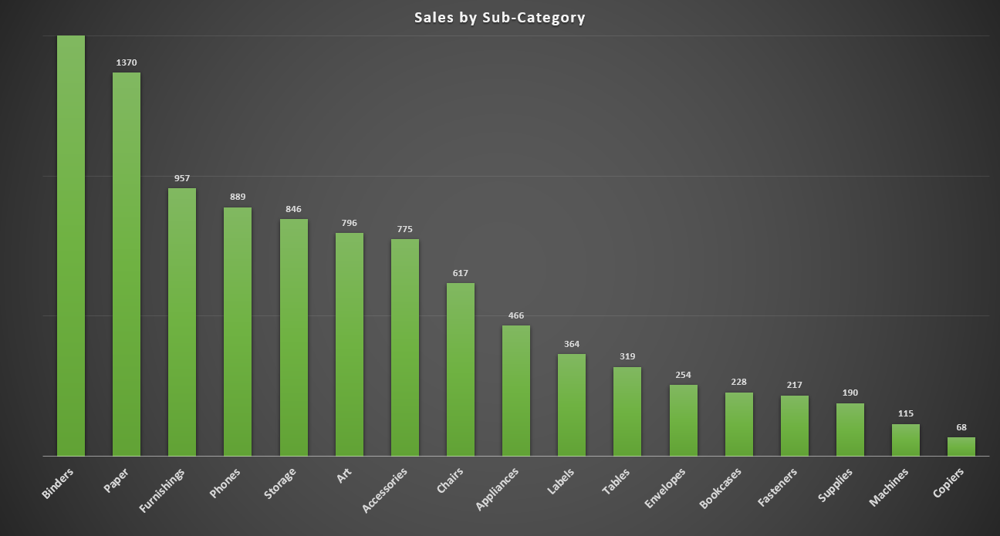
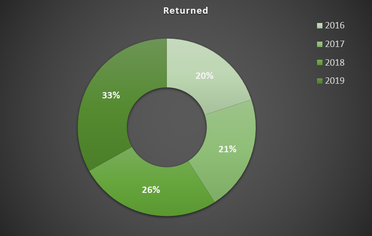

# 1. Аналитика в организации
#### [Назад в Содержание ⤶](/README.md)

## 1.1 Архитектура аналитического решения
Архитектура аналитического решения торговой сети **«Superstore»** имеет 3 уровня:
- #### Source Layer (слой источников данных)
_Данные собираются из различных источников (API сайта, промежуточной БД, системы CRM) с помощью ETL/ELT процессов._
- #### Storage Layer (слой хранения данных)
_Единая целевая БД – Хранилище данных._
- #### Business Layer (слой для доступа к данным)
_Данные как товар для целевой аудитории – бизнес клиентов, аналитиков._

Воспользуемся программой **[draw.io](https://github.com/jgraph/drawio-desktop/releases/tag/v26.2.2)** для отрисовки 
схемы нашей архитектуры.

##### [Скачать схему](data/architecture_of_the_analytical_solution.zip)

## 1.2. Работа в Excel
Задача построить отчеты и дашборд в **Excel** на основе [полученных данных](data/Sample%20-%20Superstore.xls).

### 1.2.1 Знакомство с данными
После ознакомления с первичными данными, последовало их объединение в одну рабочую таблицу `Orders`, 
на основе которой будет построена отчетность и дашборд.

### 1.2.2 Составление плана отчетности
Важно определить, что будет выведено и в каком виде, т.к. от этого зависит результат последующего анализа.

> _В процессе работы не забудьте обсудить содержание отчёта с заинтересованными лицами!_

#### План отчетности
Итак, отчет будет состоять из следующих параметров и показателей:

|***Параметры и показатели***|***Визуализация***|
|---|---|
|Динамика дохода и прибыли|Диаграмма-график|
|Категории товаров (сравнение)|Линейчатая диаграмма|
|Суб-Категории товаров (сравнение)|Гистограмма|
|Региональные менеджеры (сравнение)|Гистограмма|
|Сегменты (сравнение)|Гистограмма|
|Динамика по сегментам|Диаграмма-график|
|По штатам|Картограмма|
|Основные показатели|Таблица|
|По регионам (сравнение)|Круговая|
|По возвратам в %|Круговая|

### 1.2.3 Создание отчетов (диаграмм)
Создаем диаграммы на основе сводных таблиц, следуя составленному плану:
- Динамика дохода и прибыли

- Категории товаров (сравнение)

- Суб-категории товаров (сравнение)

- Региональные менеджеры (сравнение)

- Сегменты (сравнение)

- Динамика по сегментам

- По штатам

- Основные показатели

- По регионам (сравнение)

- По возвратам в %

### 1.2.4 Создание дашборда
На основе созданных диаграмм собираем дашборд. Добавляем срезы и подключаем их к отчётам. Всё красиво расставляем.

##### [Скачать Дашборд](data/superstore%20dashboard.xlsx)