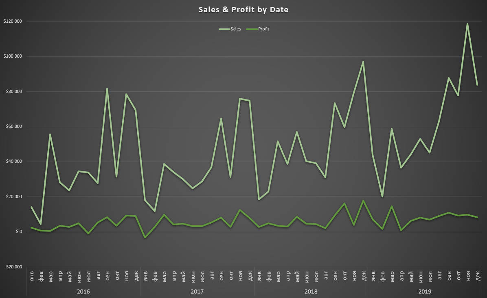
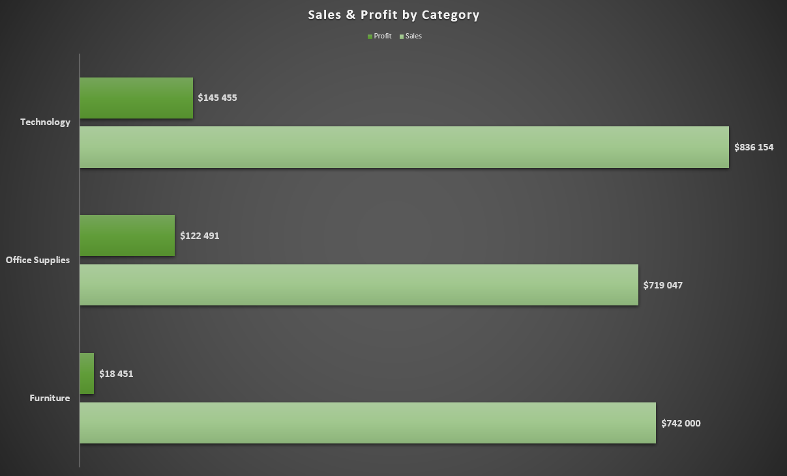
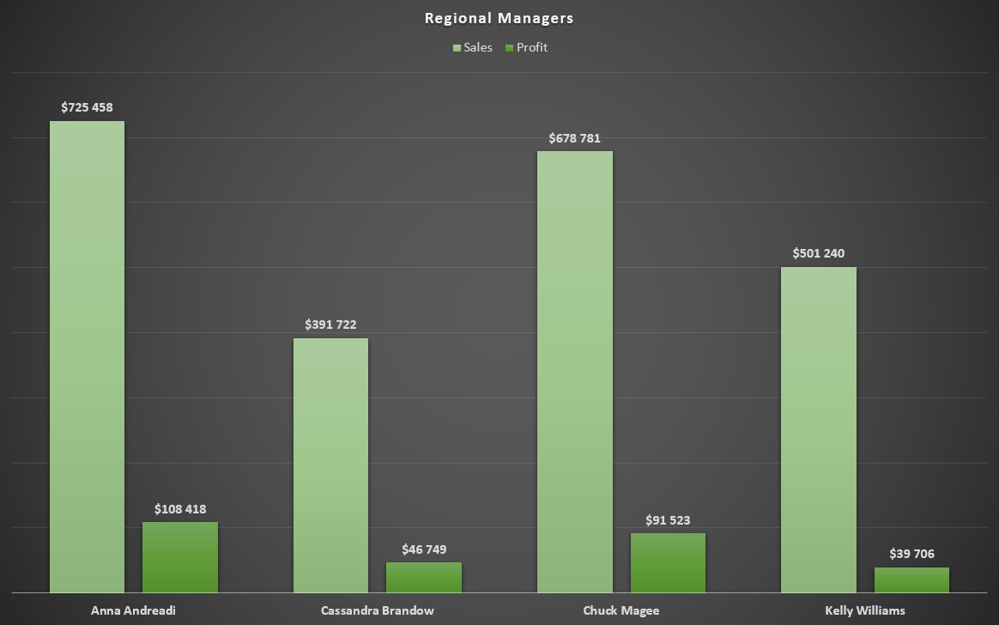
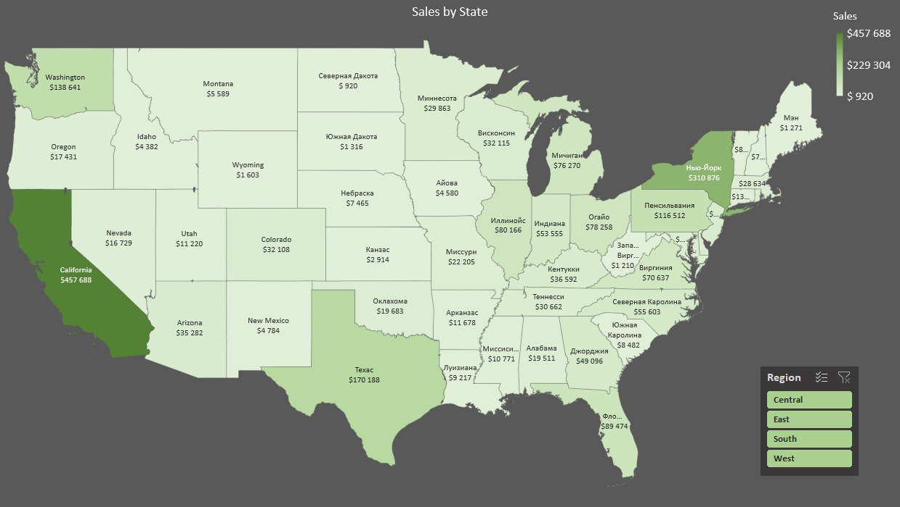
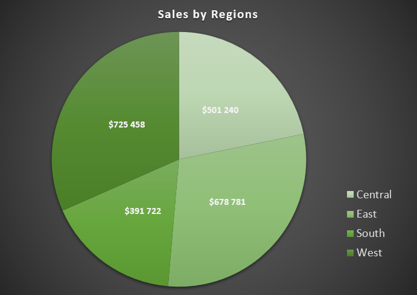
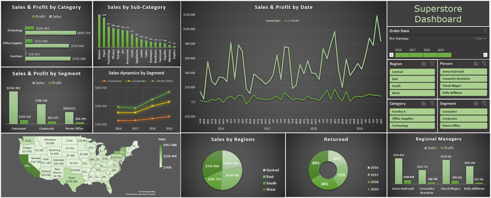

# 1. Аналитика в организации
## 1.1 Архитектура аналитического решения
Архитектура аналитического решения торговой сети «Superstore» имеет 3 уровня:
- ***Source Layer*** — слой источников данных. 
> Данные собираются из различных источников (API сайта, промежуточной БД, системы CRM) с помощью ETL/ELT процессов.
- ***Storage Layer*** — слой хранения данных.
> Единая целевая БД — Хранилище данных.
- ***Business Layer*** — слой для доступа к данным.
> Данные как товар для целевой аудитории — бизнес клиентов, аналитиков.

##### [Скачать схему](data/architecture_of_the_analytical_solution.zip)

## 1.2. Работа в Excel
Задача построить отчёты и дашборд в Excel на основе [полученных данных](data/Sample%20-%20Superstore.xls).

### 1.2.1 Знакомство с данными
После ознакомления с первичными данными, последовало их объединение в одну рабочую таблицу `Orders`, 
на основе которой будет построена отчётность и дашборд.

### 1.2.2 Составление плана отчётности
Важно определить что будет выведено и в каком виде, т.к. от этого зависит результат последующего анализа.

> Обсудить содержание отчёта с заинтересованными лицами!

Итак, отчёт будет состоять из следующих параметров и показателей:

|***Параметры и показатели***|***Визуализация***|
|---|---|
|Динамика дохода и прибыли|Диаграмма-график|
|Категории товаров (сравнение)|Линейчатая диаграмма|
|Суб-Категории товаров (сравнение)|Гистограмма|
|Региональные менеджеры (сравнение)|Гистограмма|
|Сегменты (сравнение)|Гистограмма|
|Динамика по сегментам|Диаграмма-график|
|По штатам|Картограмма|
|Основные показатели|Таблица|
|По регионам (сравнение)|Круговая|
|По возвратам в %|Круговая|

### 1.2.3 Создание отчётов (диаграмм)
Создаём диаграммы на основе сводных таблиц, следуя составленному плану:
- Динамика дохода и прибыли

- Категории товаров (сравнение)

- Суб-категории товаров (сравнение)

- Региональные менеджеры (сравнение)

- Сегменты (сравнение)

- Динамика по сегментам

- По штатам

- Основные показатели

- По регионам (сравнение)

- По возвратам в %

### 1.2.4 Создание дашборда
На основе созданных диаграмм собираем дашборд. Добавляем срезы и подключаем их к отчётам. Всё красиво расставляем.

##### [Скачать Дашборд](data/superstore%20dashboard.xlsx)