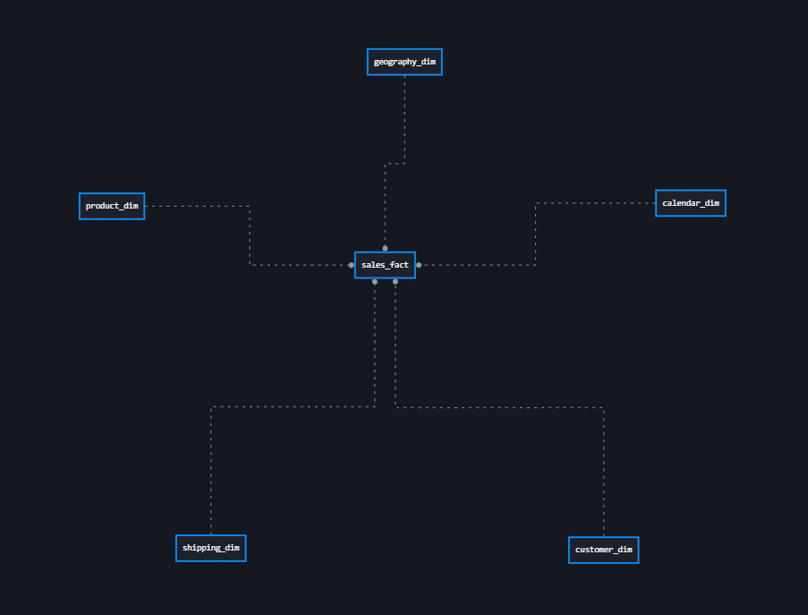
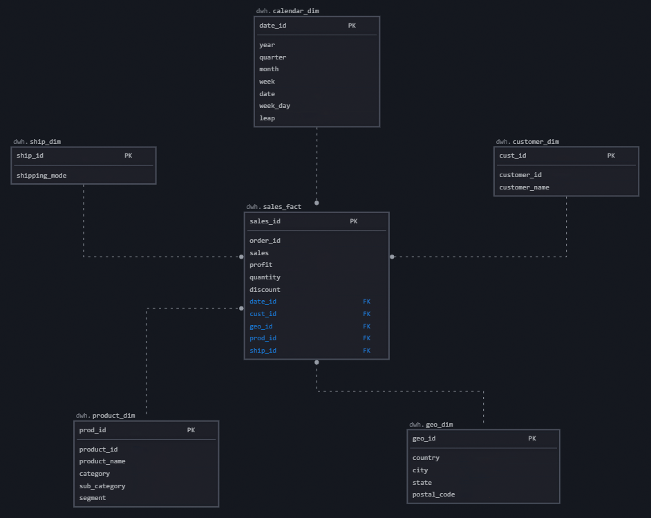
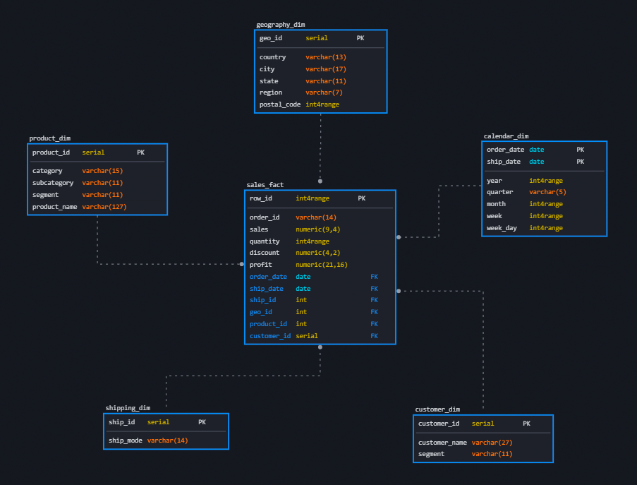

# 2. Базы данных и SQL

#### [Назад в Содержание ⤶](/README.md)

> _**База данных** (БД)_ — инструмент для хранения и организации данных. 

## 2.1 Staging слой
После установки **PostgreSQL** и подключения к БД через **DBeaver**, приступаем к созданию таблиц и загрузке данных.

#### Создание таблиц и загрузка данных
Для начала создадим схему `staging`.

```sql
CREATE SCHEMA staging;
```

Далее создаем таблицы и наполняем их данными.
- _Таблица [Orders](data/staging/orders.md)_
- _Таблица [People](data/staging/people.md)_
- _Таблица [Returns](data/staging/returns.md)_

#### Заключение
На данном этапе **Staging** слой нашего Хранилища данных готов.

## 2.2 SQL запросы
В соответсвии с планом отчетности пишем [SQL запросы](data/queries.md) к нашей БД.

## 2.3 Модели данных (Business слой)
### 2.3.1 Выбор схемы для Хранилища данных

> _**Хранилище данных** (Data Warehouse, DWH)_ — система для централизованного хранения и управления большим объёмом 
> структурированных данных, собранных из различных источников, для использования их в аналитике и отчётности.

На основе имеющихся данных, построим **Хранилище данных** нашего «Superstore».
За основу архитектуры возьмем способ структурирования Ральфа Кимбалла – схему «Звезда».

#### Преимущества схемы типа «Звезда»:
- **Простота** – _легко понять и использовать._
- **Производительность** – _запросы к данным выполняются быстрее (т.к. меньше соединений между таблицами)._
- **Гибкость** – _легко добавлять новые измерения и факты без значительных изменений в существующей структуре._

Схема типа «Звезда» является основным инструментом для построения Хранилищ данных и используется в системах OLAP для анализа и отчетности.

### 2.3.2 Отрисовка схемы
Воспользуемся ресурсом [SqlDBM](https://sqldbm.com/Home/) для отрисовки модели данных нашего Superstore.
- _Концептуальная схема_



- _Логическая схема_



- _Физическая схема_



### 2.3.3 Основные компоненты схемы
#### Таблица фактов
`sales_fact`
- Центральная таблица, которая содержит количественные данные (факты) – продажи, доходы и другие метрики.
- Включает ключи, связывающие её с таблицами измерений, а также числовые показатели, которые будут анализироваться.

#### Таблицы измерений
- Окружают таблицу фактов и содержат атрибуты, которые описывают факты.
- Атрибуты таблиц измерений позволяют фильтровать и агрегировать данные по различным критериям.

`calendar_dim` – содержит данные о дате заказа, доставки.

`customer_dim` – содержит данные о покупателе, сегменте.

`geo_dim` – содержит данные о месте получения заказа.

`product_dim` – содержит данные о категории / подкатегории товаров.

`shipping_dim` – содержит данные о типе доставки.

### 2.3.4 Генерация кода для создания Хранилища данных
В нашем проекте на [SqlDBM](https://sqldbm.com/Home/) сгенерируем код (DDL команды) для создания Хранилища данных.

#### Создание таблиц и загрузка данных 
Для начала создадим схему `dwh` в **DBeaver**.

```sql
CREATE SCHEMA dwh;
```
Используем сгенерированный код для создания нашего датасета, дополнив его проверками, 
и наполним данными из Staging слоя.

- _Измерение [calendar_dim](data/dwh/calendar_dim.md)_
- _Измерение [customer_dim](data/dwh/customer_dim.md)_
- _Измерение [geo_dim](data/dwh/geo_dim.md)_
- _Измерение [product_dim](data/dwh/product_dim.md)_
- _Измерение [shipping_dim](data/dwh/shipping_dim.md)_
- _Метрики [sales_fact](data/dwh/sales_fact.md)_

#### Заключение
На данном этапе **Business** слой нашего Хранилища данных готов.

## 2.4 База данных в облаке
