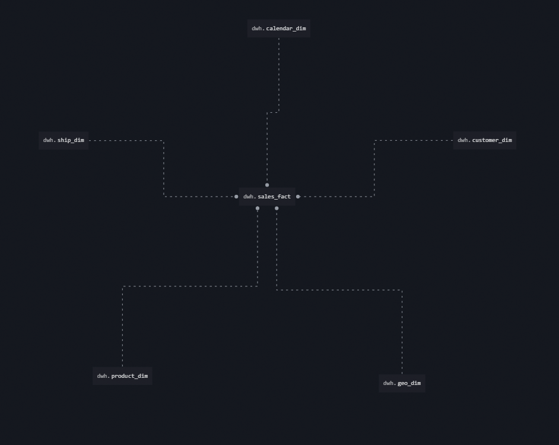

# 2. Базы данных и SQL
#### [Назад в Data Learn ⤶](/README.md)

## 2.1 Загрузка данных в БД
После установки **PostgreSQL** и подключения к БД через **DBeaver**, приступаем к созданию таблиц и загрузке данных.
#### Создание таблиц и загрузка данных
- _Таблица [Orders](data/orders.sql)_
- _Таблица [People](data/people.sql)_
- _Таблица [Returns](data/returns.sql)_

## 2.2 SQL запросы
В соответсвии с планом отчетности пишем [SQL запросы](data/sql_querys.md) к нашей БД.

## 2.3 Модели данных
На основе имеющихся данных, построим ***Хранилище данных*** нашего «Superstore».
За основу архитектуры возьмем способ структурирования Ральфа Кимбалла – схему «Звезда».
Схема имеет централизованное Хранилище данных, которое хранится в таблице фактов и разбивает таблицу фактов 
на ряд денормализованных таблиц измерений. 

#### Воспользуемся ресурсом [SqlDBM](https://sqldbm.com/Home/) для отрисовки модели данных нашего Superstore.
- _Концептуальная схема_

- _Логическая схема_

- _Физическая схема_

#### Таблица фактов
_Таблица фактов содержит агрегированные данные, которые будут использоваться для составления отчетов._
- **sales_fact** – наша таблица фактов.

#### Таблицы измерений
_Таблицы измерений описывают хранимые данные._
- **geography_dim** – содержит данные о месте получения заказа.
- **calendar_dim** – содержит данные о дате заказа, доставки.
- **customer_dim** – содержит данные о покупателе, сегменте.
- **shipping_dim** – содержит данные о типе доставки.
- **product_dim** – содержит данные о категории (и подкатегории) товаров.

#### Хранилище данных
В нашем проекте на [SqlDBM](https://sqldbm.com/Home/) сгенерируем код для создания Хранилища данных, 
чтобы использовать его для создания ХД в облаке.

- [DDL команды](data/dwh.md) для создания Хранилища данных.

## 2.4 База данных в облаке
