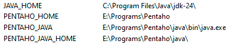

# 4. Интеграция и трансформация данных
#### [Назад в Содержание ⤶](/README.md)

## 4.1 ETL и ELT
> _**ETL** (Extract, Transform, Load)_ — процесс извлечения, преобразования и загрузки данных в целевой пункт 
> назначения (обычно это Хранилище данных).

> _**ELT** (Extract, Load, Transform)_ — это современный подход к обработке данных, который отличается от традиционного 
> ETL порядком выполнения операций.

### ETL vs ELT

|    _Характеристика_     |                 _ETL_                  |                    _ELT_                     |
|:-----------------------:|:--------------------------------------:|:--------------------------------------------:|
|        _Порядок_        |  Извлечь → Преобразовать → Загрузить   |     Извлечь → Загрузить → Преобразовать      |
|       _Гибкость_        | Низкая (изменения требуют перезапуска) | Высокая (можно менять трансформации на лету) |
|       _Скорость_        |      Медленнее для больших данных      |      Быстрее (использует мощности DWH)       |
| _Хранение сырых данных_ |         Обычно не сохраняются          |         Сохраняются в исходном виде          |

ETL актуален для строго структурированных процессов, но в современных облачных хранилищах чаще применяют ELT или 
_гибридные подходы_.

## 4.2 ETL компоненты
### Извлечение (Extract)
**Цель**: Сбор данных из различных источников.

**Источники данных**:
  - Базы данных (SQL, NoSQL)
  - Файлы (CSV, JSON, XML)
  - API
  - Веб-страницы

### Преобразование (Transform)
**Цель**: Обработка и преобразование данных для анализа.

**Процессы**:
  - Очистка данных (удаление дубликатов, исправление ошибок)
  - Обогащение данных (добавление новых атрибутов)
  - Изменение формата данных (например, преобразование дат)
  - Агрегация данных (суммирование, средние значения)

### Загрузка (Load)
**Цель**: Перенос преобразованных данных в целевую систему.

**Целевые системы**:
  - Хранилища данных (Data Warehouses)
  - Базы данных
  - Аналитические платформы

> ETL компоненты играют критическую роль в управлении данными и обеспечивают их доступность для анализа и отчетности.

## 4.3 Начало работы с ETL
### 4.3.1 Выбор ETL-инструмента
В качестве ETL-инструмента будем использовать _open-source_ решение –
**[Pentaho Data Integration](https://community.pentaho.com/home)**. 

После скачивания и установки Pentaho, устанавливаем переменные среды (если есть необходимость) и можно приступать 
к работе.

В моем случае установлено было так:

### 4.3.2 Основные элементы и типы проектов
В Pentaho Data Integration (PDI) ***Steps*** и ***Hops*** являются основными элементами, которые помогают в создании 
и выполнении ETL-процессов.
В PDI есть два типа проектов — ***Jobs*** и ***Transformations***.
