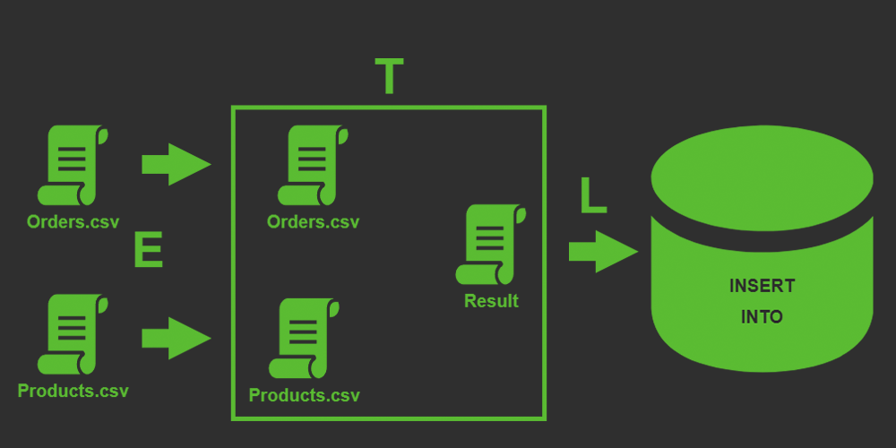
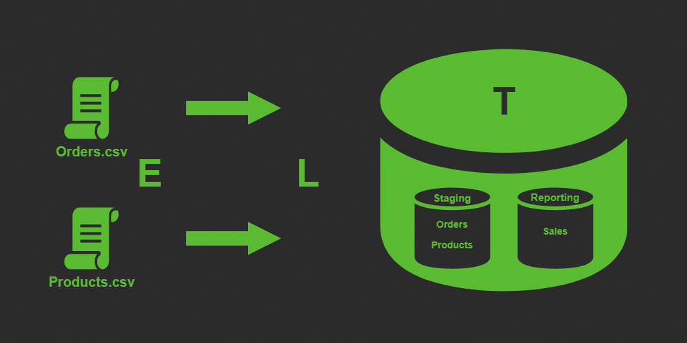

# 4. Интеграция и трансформация данных

#### [Назад в Содержание ⤶](/README.md)

## 4.1 ETL и ELT
Сначала разберемся, что это такое.

> _**ETL** (Extract, Transform, Load)_ — процесс извлечения, преобразования и загрузки данных в целевой пункт 
> назначения (обычно это Хранилище данных).

> _**ELT** (Extract, Load, Transform)_ — это современный подход к обработке данных, который отличается от традиционного 
> ETL порядком выполнения операций.

### ETL vs ELT

|    _Характеристика_     |                 _ETL_                  |                    _ELT_                     |
|:-----------------------:|:--------------------------------------:|:--------------------------------------------:|
|        _Порядок_        |  Извлечь → Преобразовать → Загрузить   |     Извлечь → Загрузить → Преобразовать      |
|       _Гибкость_        | Низкая (изменения требуют перезапуска) | Высокая (можно менять трансформации на лету) |
|       _Скорость_        |      Медленнее для больших данных      |      Быстрее (использует мощности DWH)       |
| _Хранение сырых данных_ |         Обычно не сохраняются          |         Сохраняются в исходном виде          |

> 💡ETL актуален для строго структурированных процессов, но в современных облачных хранилищах чаще применяют ELT или 
_гибридные подходы_.

## 4.2 ETL компоненты
### E — Извлечение (Extract)
**Цель**: Сбор данных из различных источников.

**Источники данных**:
  - Базы данных (SQL, NoSQL)
  - Файлы (CSV, JSON, XML)
  - API
  - Веб-страницы

### T — Преобразование (Transform)
**Цель**: Обработка и преобразование данных для анализа.

**Процессы**:
  - Очистка данных (удаление дубликатов, исправление ошибок)
  - Обогащение данных (добавление новых атрибутов)
  - Изменение формата данных (например, преобразование дат)
  - Агрегация данных (суммирование, средние значения)

### L — Загрузка (Load)
**Цель**: Перенос преобразованных данных в целевую систему.

**Целевые системы**:
  - Хранилища данных (Data Warehouses)
  - Базы данных
  - Аналитические платформы

> 💡 **ETL** компоненты играют критическую роль в управлении данными и обеспечивают их доступность для анализа и 
> отчетности.

## 4.3 Выбор ETL инструмента
ETL инструментов очень много, их можно разделить на _проприетарные_, _облачные_ и _open-source_ решения, но назначение 
у всех одно — интеграция и управление данными. 

### 4.3.1 Начало работы с Pentaho DI
Знакомство с ETL начнем с инструмента **[Pentaho Data Integration](/DE-101/Module4/data/pentaho.md)**.

### 4.3.2 Создание пайплайнов в Pentaho DI
После знакомства с инструментом выполним задание по созданию двухуровнего Хранилища данных с помощью **PDI** для нашего 
«Superstore».

### Staging

[Transformation для создания Staging слоя](/DE-101/Module4/data/pentaho/transformation_stg.ktr)

_Метрики_

### DWH
...

## 4.4 ETL подсистемы (ETL Subsystems)
Процесс ETL включает **[34 подсистемы](/DE-101/Module4/data/subsystems.md)** в 4 группах: 
1. ***Извлечение данных***.
2. ***Очистка и приведение в соответствие данных*** (подготовка к загрузке в DWH).
3. ***Предоставление данных для презентации*** (обработка в DWH).
4. ***Управление и мониторинг компонентов ETL***.

## 4.5 Fancy ETL инструменты
Рассмотрим некотрые популярные инструменты.

### - [Apache Airflow](/DE-101/Module4/data/airflow.md)
### - [Dagster](/DE-101/Module4/data/dagster.md)
### - [Data Build Tool](/DE-101/Module4/data/dbt.md)